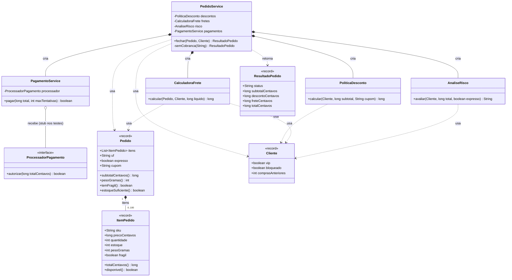
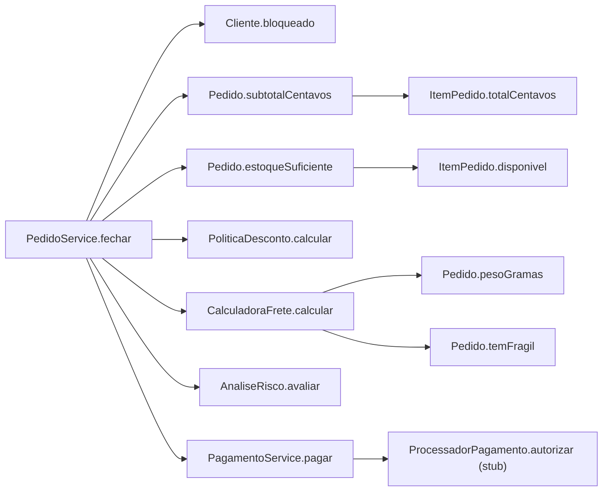
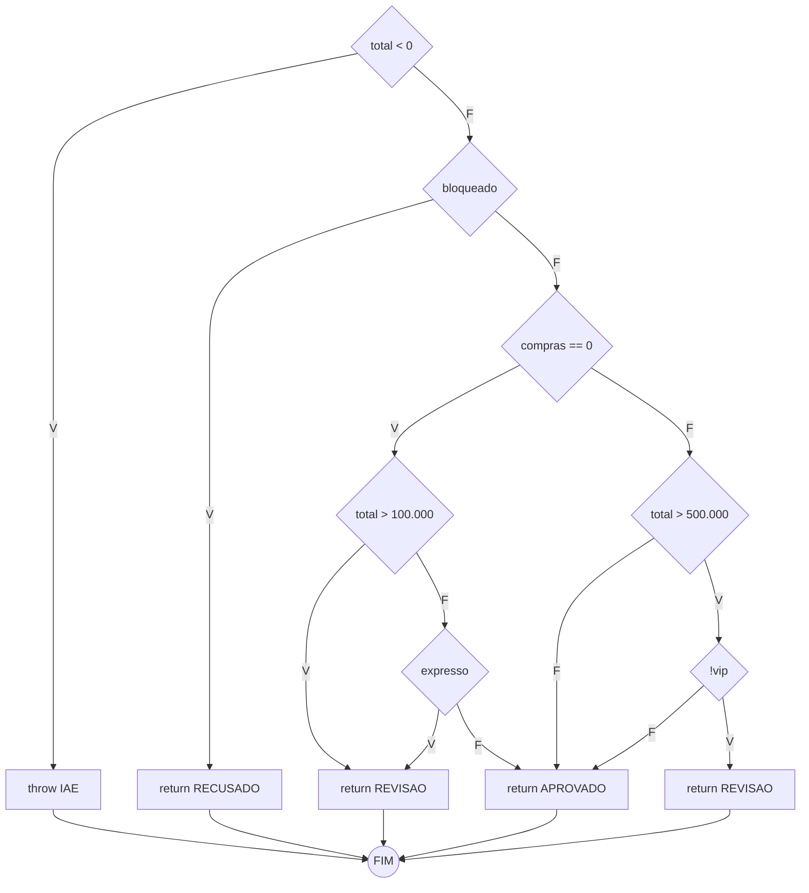
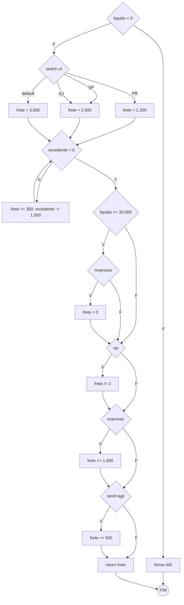
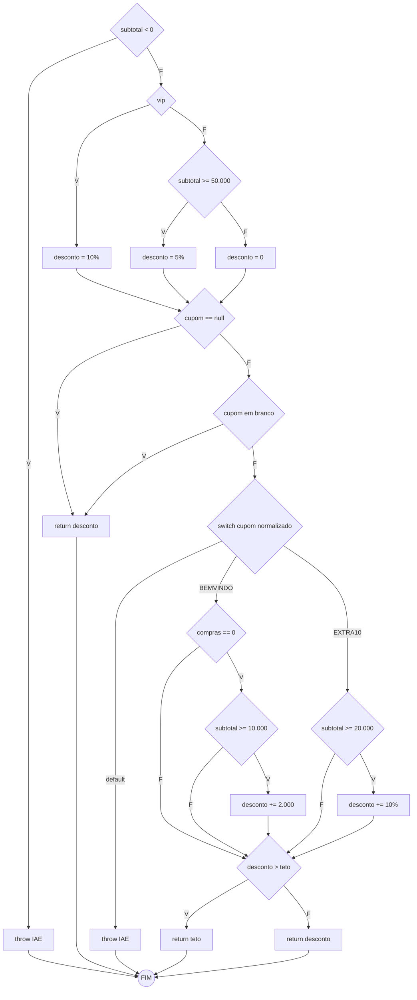
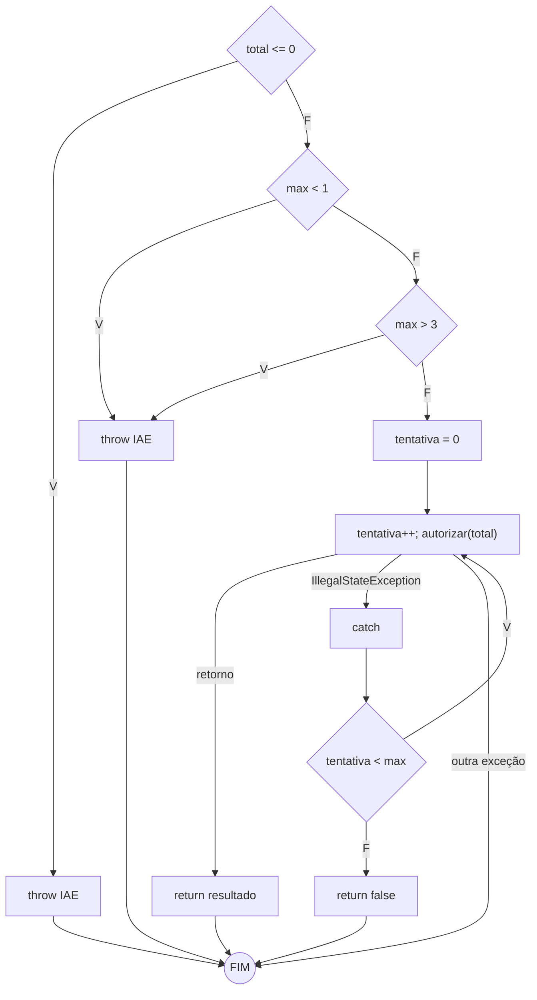
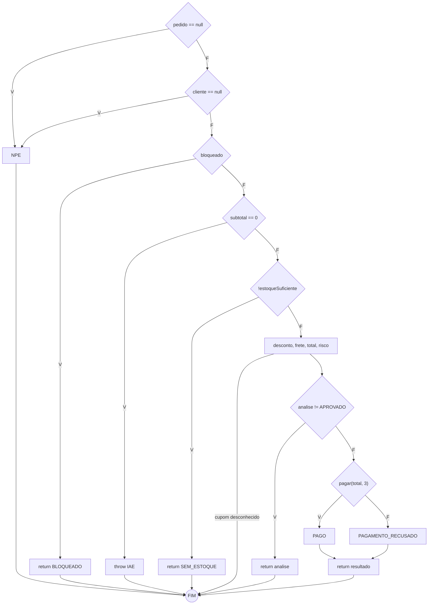
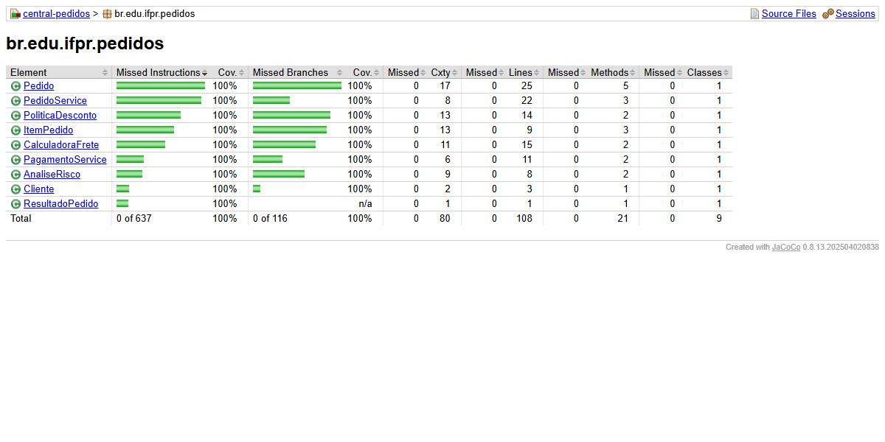
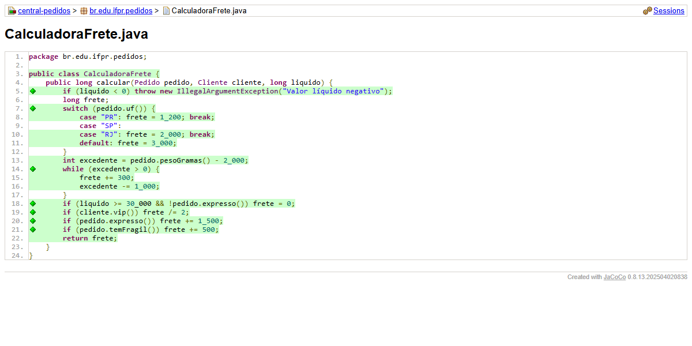
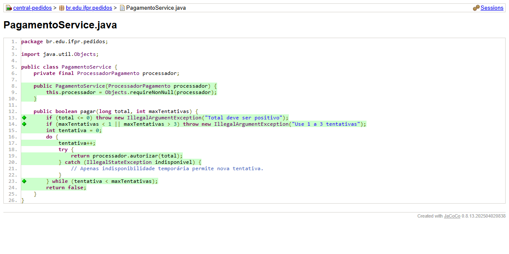

# Relatório do grupo — Central de Pedidos (Teste Estrutural)

Integrantes: Thiago Gimenes e _________________

**Ferramentas:** Java 17, Maven, JUnit 5 (Jupiter + Params) e JaCoCo 0.8.13.
**Execução:** `mvn clean test` → relatório em `target/site/jacoco/index.html`.

---

## 1. Relacionamento entre classes

`PedidoService` cria e compõe as três regras de negócio e o serviço de pagamento. A única dependência externa é a interface `ProcessadorPagamento`, que é injetada pelo construtor. Nos testes, ela é substituída por um stub (lambda ou classe `StubProcessador`).

## 1.1 Grafo de chamadas de `PedidoService.fechar`

## 2. Modelo adotado para os CFGs

- **Um nó por condição:** em `a && b` e `a || b`, cada operando é um nó de decisão separado. Isso torna visível o curto-circuito.
- **Saída unificada:** todos os `return` e `throw` apontam para um único nó `FIM`, o que deixa o grafo conectado e permite usar `V(G) = E − N + 2`.
- **Exceções:** um `throw` explícito é um nó que leva ao `FIM`. No `try/catch` de `pagar`, a chamada `autorizar` tem três saídas: retorno normal, `IllegalStateException` (catch) e outra exceção (propagada). Em `fechar`, as verificações de `requireNonNull` e o cupom desconhecido lançado por `PoliticaDesconto` também são arestas de exceção.
- **switch:** cada rótulo de `case` é uma aresta própria. Por isso, `case "SP"` e `case "RJ"` são duas arestas paralelas para o mesmo bloco.

### 2.1 `AnaliseRisco.avaliar`

N = 13, E = 19 → **V(G) = 19 − 13 + 2 = 8** (7 condições + 1).

### 2.2 `CalculadoraFrete.calcular`

N = 19, E = 28 → **V(G) = 28 − 19 + 2 = 11**.

### 2.3 `PoliticaDesconto.calcular`

N = 21, E = 31 → **V(G) = 31 − 21 + 2 = 12**.

### 2.4 `PagamentoService.pagar`

N = 12, E = 17 → **V(G) = 17 − 12 + 2 = 7**.

### 2.5 `PedidoService.fechar`

N = 17, E = 24 → **V(G) = 24 − 17 + 2 = 9**.

## 3. Resumo de complexidade

| Método | Nós | Arestas | V(G) no modelo | V(G) JaCoCo | Caminhos independentes (IDs) | Restrições de viabilidade |
| --- | :-: | :-: | :-: | :-: | --- | --- |
| `AnaliseRisco.avaliar` | 13 | 19 | 8 | 8 | R1–R8 | Pelo serviço, R2 (`RECUSADO`) é inviável: o bloqueio retorna antes. R1 (total negativo) também é inviável pelo serviço |
| `CalculadoraFrete.calcular` | 19 | 28 | 11 | 10 | F1–F11 | F1 (líquido negativo) é inviável pelo serviço, pois o teto de 20% impede desconto maior que o subtotal |
| `PoliticaDesconto.calcular` | 21 | 31 | 12 | 12 | D1–D12 | D1 (subtotal negativo) é inviável pelo serviço, porque os itens só têm preço e quantidade não negativos |
| `PagamentoService.pagar` | 12 | 17 | 7 | 5 | P1–P7 | Pelo serviço, P1–P3 são inviáveis: o total é sempre positivo e o limite é fixo em 3 |
| `PedidoService.fechar` | 17 | 24 | 9 | 6 | S1–S9 | — |

**Por que o modelo e o JaCoCo divergem:**

- **`pagar`:** o JaCoCo não conta as arestas de exceção (catch e propagação) como branches, então fica 7 − 2 = 5.
- **`fechar`:** as duas verificações de `requireNonNull` e o cupom desconhecido são exceções lançadas dentro de outros métodos, então fica 9 − 3 = 6.
- **`calcular` do frete:** o JaCoCo mede sobre o bytecode, em que o `switch` de `String` vira `hashCode` + `equals`. No nosso modelo, `SP` e `RJ` são duas arestas paralelas para o mesmo bloco.

## 4. Matriz de testes (base de caminhos)

| ID / método JUnit | Unidade | Entrada e estado do stub | Resultado esperado | Caminho / aresta | Critério atendido |
| --- | --- | --- | --- | --- | --- |
| R1 `r1TotalNegativo` | AnaliseRisco | total −1 | IAE | N1→N2 | Ramo V de `total<0` |
| R2 `r2Bloqueado` | AnaliseRisco | bloqueado, total 100 | RECUSADO | N3→N4 | Retorno antecipado |
| R3 `r3NovoAcimaDoLimite` | AnaliseRisco | novo, 100.001 | REVISAO | N6→N8 | Limite + 1; `||` sem avaliar expresso |
| R4 `r4NovoExpresso` | AnaliseRisco | novo, 1.000, expresso | REVISAO | N7→N8 | Operando direito do `||` |
| R5 `r5NovoNoLimite` | AnaliseRisco | novo, 100.000 | APROVADO | N7→N11 | Valor-limite exato |
| R6 `r6RecorrenteNoLimite` | AnaliseRisco | recorrente, 500.000 | APROVADO | N9→N11 | `&&` sem avaliar `!vip` |
| R7 `r7RecorrenteAcimaDoLimite` | AnaliseRisco | recorrente, 500.001 | REVISAO | N10→N12 | Limite + 1 |
| R8 `r8RecorrenteVip` | AnaliseRisco | VIP recorrente, 500.001 | APROVADO | N10→N11 | Ramo F de `!vip` |
| F1 `f1LiquidoNegativo` | CalculadoraFrete | líquido −1 | IAE | N1→N2 | Exceção |
| F2 `f2Referencia` | CalculadoraFrete | PR, 1 kg, comum, 10.000 | 1.200 | case PR, while 0× | Caminho de referência |
| F3–F5 `f3aF5TarifaPorUf` | CalculadoraFrete | SP / RJ / AM | 2.000 / 2.000 / 3.000 | case SP, RJ, default | Todos os cases |
| F6 `f6AdicionalPorPeso` | CalculadoraFrete | 2.000 / 2.001 / 3.000 / 3.001 / 4.500 g | 1.200 / 1.500 / 1.500 / 1.800 / 2.100 | while 0×, 1×, 2×, 3× | Laço e fração de kg |
| F7 `f7FreteGratis` | CalculadoraFrete | líquido 30.000, normal | 0 | N10→N11 | Limite exato |
| F8 `f8ExpressoNaoZera` | CalculadoraFrete | líquido 30.000, expresso | 2.700 | N10→N12 | Ramo F do 2º operando do `&&` |
| F9 `f9Vip` | CalculadoraFrete | VIP | 600 | N12→N13 | Ramo V de `vip` |
| F10 `f10Expresso` | CalculadoraFrete | expresso | 2.700 | N14→N15 | Ramo V de `expresso` |
| F11 `f11Fragil` | CalculadoraFrete | item frágil ativo | 1.700 | N16→N17 | Ramo V de `temFragil` |
| D1 `d1SubtotalNegativo` | PoliticaDesconto | subtotal −1 | IAE | N1→E1 | Exceção |
| D2 `d2VipSemCupom` | PoliticaDesconto | VIP, 10.000, null | 1.000 | N2→N3, N6→N7 | Curto-circuito em `cupom == null` |
| D3 `d3ComumNoLimiteDe500` | PoliticaDesconto | comum, 50.000 | 2.500 | N4→N5a | Limite exato |
| D4 `d4ComumAbaixoDe500` | PoliticaDesconto | comum, 49.999 | 0 | N4→N5b | Limite − 1 |
| D5 `d5CupomEmBranco` | PoliticaDesconto | cupom `""` / `"   "` | 1.000 | N8→N7 | Operando direito do `||` |
| D6 `d6BemVindoElegivel` | PoliticaDesconto | novo, 10.000, BEMVINDO | 2.000 | N11→N12, N15→N17 | Limite exato |
| D7 `d7BemVindoComHistorico` | PoliticaDesconto | 1 compra, BEMVINDO | 0 | N10→N15 | `&&` sem avaliar subtotal |
| D8 `d8BemVindoAbaixoDoMinimo` | PoliticaDesconto | novo, 9.999, BEMVINDO | 0 | N11→N15 | Limite − 1 |
| D9 `d9Extra10Elegivel` | PoliticaDesconto | 20.000, EXTRA10 | 2.000 | N13→N14 | Limite exato |
| D10 `d10Extra10AbaixoDoMinimo` | PoliticaDesconto | 19.999, EXTRA10 | 0 | N13→N15 | Limite − 1 |
| D11 `d11CupomDesconhecido` | PoliticaDesconto | PROMO | IAE | N9→E2 | Default do switch |
| D12 `d12TetoDeVintePorCento` | PoliticaDesconto | VIP novo, 10.000, BEMVINDO | 2.000 (teto) | N15→N16 | Ramo V do teto |
| P1 `p1TotalNaoPositivo` | PagamentoService | total 0 / −1; stub vazio | IAE, 0 chamadas | N1→N2 | Exceção |
| P2 `p2LimiteAbaixoDoMinimo` | PagamentoService | limite 0 | IAE, 0 chamadas | N3→N4 | Limite − 1 |
| P3 `p3LimiteAcimaDoMaximo` | PagamentoService | limite 4 | IAE, 0 chamadas | N5→N4 | Limite + 1 |
| P4 `p4AprovadoNaPrimeira` | PagamentoService | stub [true] | true, chamadas [11.200] | N7→N8 | do/while 1× |
| P5 `p5EsgotaComUmaTentativa` | PagamentoService | stub [ISE], limite 1 | false, 1 chamada | N9→N10→N11 | Esgotamento |
| P6 `p6RepeteAposIndisponibilidade` | PagamentoService | stub [ISE, true] | true, 2 chamadas | N10→N7 | do/while 2× |
| P7 `p7OutraExcecaoPropaga` | PagamentoService | stub [IAE, true] | IAE propagada, 1 chamada | N7→FIM | Propagação |
| S1/S2 `s1s2ReferenciasNulas` | PedidoService | pedido ou cliente nulo | NPE, 0 cobranças | N1/N2→E1 | Exceção |
| S3 `s3ClienteBloqueado` | PedidoService | bloqueado, lista vazia, cupom inválido | BLOQUEADO com zeros, 0 cobranças | N3→N4 | Ordem do contrato |
| S4 `s4SemItensAtivos` | PedidoService | lista vazia / só inativos | IAE, 0 cobranças | N5→E2 | Exceção |
| S5 `s5SemEstoque` | PedidoService | qtd 3, estoque 2, cupom inválido | SEM_ESTOQUE com zeros | N6→N7 | Estoque antes do cupom |
| S6 `s6CupomDesconhecido` | PedidoService | cupom PROMO | IAE, 0 cobranças | N8→FIM | Exceção de colaborador |
| S7 `s7RevisaoPorExpresso` | PedidoService | novo, expresso | REVISAO 10.000/0/2.700/12.700, 0 cobranças | N9→N10 | Sem cobrança |
| S8 `s8PagoVipComCupom` | PedidoService | VIP, SP, " extra10 ", frágil, inativo; stub [true] | PAGO 45.000/9.000/500/36.500, cobranças [36.500] | N11→N12 | Colaboração completa |
| S9 `s9PagamentoRecusado` | PedidoService | stub [false] | PAGAMENTO_RECUSADO 10.000/0/1.200/11.200 | N11→N13 | Ramo F do pagamento |

Testes adicionais (limites, truncamento, iterações e combinações) estão identificados pelo `@DisplayName` em cada classe de teste.

## 5. Evolução da cobertura

Cada etapa acrescenta uma classe de teste às anteriores e foi medida com `mvn clean test -Dtest=...` e JaCoCo.

| Etapa | Testes executados | Linhas | Branches | Métodos | Classes | O que o novo teste acrescentou / lacunas restantes |
| --- | :-: | :-: | :-: | :-: | :-: | --- |
| E0 - Inicial | 0 | Não medido | Não medido | Não medido | Não medido | Sem testes |
| E1 - Exemplo do professor | 1 | 87/108 (80,6%) | 50/116 (43,1%) | 20/21 (95,2%) | 9/9 | Só o caminho PAGO. Faltam `semCobranca` e todos os ramos de validação, desconto, frete, risco e retentativa |
| E2 - + ClienteTest, ItemPedidoTest, PedidoTest | 50 | 89/108 (82,4%) | 69/116 (59,5%) | 20/21 (95,2%) | 9/9 | **+19 branches**: `Cliente`, `ItemPedido` e `Pedido` chegam a 100% (validações, `continue`, `break` e retorno antecipado de `temFragil`) |
| E3 - + PoliticaDescontoTest | 72 | 97/108 (89,8%) | 86/116 (74,1%) | 20/21 (95,2%) | 9/9 | **+17 branches e +8 linhas**: `PoliticaDesconto` chega a 100% (cupons, `switch`, `default` e teto) |
| E4 - + CalculadoraFreteTest | 92 | 101/108 (93,5%) | 96/116 (82,8%) | 20/21 (95,2%) | 9/9 | **+10 branches**: `CalculadoraFrete` chega a 100% (todos os `case`, `while` 0 a 3 vezes, gratuidade, VIP, expresso e frágil) |
| E5 - + AnaliseRiscoTest | 102 | 103/108 (95,4%) | 106/116 (91,4%) | 20/21 (95,2%) | 9/9 | **+10 branches**: `AnaliseRisco` chega a 100%, incluindo `RECUSADO`, que é inviável pelo serviço |
| E6 - + PagamentoServiceTest | 115 | 106/108 (98,1%) | 111/116 (95,7%) | 20/21 (95,2%) | 9/9 | **+5 branches**: `PagamentoService` chega a 100% (validações e `do/while` com repetição). Falta só `PedidoService`: 5 branches, 2 linhas e o método `semCobranca` |
| E7 - Final (+ PedidoServiceTest completo) | 129 | **108/108 (100%)** | **116/116 (100%)** | **21/21 (100%)** | **9/9** | **+5 branches e +1 método**: BLOQUEADO, SEM_ESTOQUE, REVISAO, PAGAMENTO_RECUSADO e `semCobranca`. Nenhuma lacuna. As exceções de `catch` e a propagação não aparecem como branches no JaCoCo, mas foram testadas (P5–P7) |

### Evidências (relatório JaCoCo após `mvn clean test`)

Resumo por classe:

Código colorido de `CalculadoraFrete` (todas as decisões cobertas):

Código colorido de `PagamentoService` (`do/while` e `try/catch`):

A pasta `target/` não é versionada (`.gitignore`). Para gerar o relatório completo, execute `mvn clean test` e abra `target/site/jacoco/index.html`.

Distribuição dos 129 testes (contando cada execução de teste parametrizado):

| Classe de teste | Testes |
| --- | :-: |
| ClienteTest | 3 |
| ItemPedidoTest | 21 |
| PedidoTest | 25 |
| PoliticaDescontoTest | 22 |
| CalculadoraFreteTest | 20 |
| AnaliseRiscoTest | 10 |
| PagamentoServiceTest | 13 |
| PedidoServiceTest | 15 |

## 6. Análise crítica

**Quais combinações faltavam mesmo com os ramos cobertos?**
Em `CalculadoraFrete.calcular` há quatro decisões independentes em sequência (gratuidade, VIP, expresso e frágil), o que dá 2⁴ = 16 combinações. Os casos F2–F11 cobrem 100% dos ramos com uma decisão alterada por vez, mas não combinações como "VIP + frágil com base zerada". Essas foram acrescentadas à parte (`adicionalAposGratuidade`, `todasAsRegras`). Mesmo assim, nem todas as 16 combinações foram testadas: **cobertura de ramos não é cobertura de caminhos**. O mesmo vale para o `while` do peso: o número de caminhos cresce com as iterações, então escolhemos 0, 1, 2 e 3 iterações, com kg exato e com fração.

**Quais condições não foram avaliadas devido ao curto-circuito?**
- `sku == null || sku.isBlank()`: com SKU nulo, `isBlank` não é chamado (senão ocorreria NPE).
- `total > 100_000 || expresso` (R3): `expresso` não é avaliado.
- `total > 500_000 && !vip` (R6): `!vip` não é avaliado.
- `comprasAnteriores == 0 && subtotal >= 10_000` (D7): o subtotal não é avaliado.
- `liquido >= 30_000 && !expresso` (F2): `expresso` não é avaliado.

Para cada uma, há também um teste em que o operando direito é avaliado.

**Quais caminhos são inviáveis no serviço, mas viáveis na unidade?**
- **`AnaliseRisco` → `RECUSADO`:** o serviço retorna `BLOQUEADO` antes de chamar a análise de risco, o que é demonstrado em `recusadoInviavelPeloServico`.
- **Totais e valores negativos** em `avaliar`, `CalculadoraFrete.calcular` e `PoliticaDesconto.calcular`: o domínio dos itens e o teto de 20% impedem que esses valores cheguem negativos pelo serviço.
- **`pagar` com limite fora de 1..3 ou total ≤ 0:** o serviço sempre usa o limite 3, e o total é positivo porque o subtotal é maior que zero.

Esses caminhos só foram exercitados nos testes unitários de cada classe.

**Como foram testadas exceções e quantidades de iterações?**
- **Exceções:** com `assertThrows`, verificando o tipo e a mensagem. Nas exceções de `PedidoService`, verificamos também que o processador **não** foi chamado (lista de cobranças vazia).
- **Retentativas do `do/while`:** com um stub que devolve uma sequência programada (`true`, `false` ou uma exceção) e registra o valor de cada chamada. Assim, conferimos 1, 2 e 3 iterações, o esgotamento e a propagação.
- **Laços `for`** de `Pedido`: zero, uma e várias linhas. O `continue` foi exercitado com linhas inativas, e o `break` com falta de estoque no início e no fim da lista.

**Qual alteração proposital foi detectada por qual teste? A alteração foi desfeita?**
Alteramos `PoliticaDesconto` de `subtotal >= 50_000` para `subtotal > 50_000`. A execução de `mvn clean test` resultou em **2 falhas** em `PoliticaDescontoTest`:

- `d3ComumNoLimiteDe500`: esperava 2.500 e obteve 0;
- `cincoMaisDezPorCento`: esperava 7.500 e obteve 5.000.

O teste `deveTruncarPercentual` (subtotal 50.001) **não** detectou a mudança, o que mostra que só o valor exatamente no limite revela esse tipo de defeito. A alteração foi **desfeita**, e o código de produção foi comparado com o original (sem diferenças). Depois disso, os 129 testes voltaram a passar.

**Conclusão:** a suíte atinge 100% de linhas, branches, métodos e classes, e cobre a base de caminhos independentes de todos os métodos de negócio. A cobertura mostra o que foi executado; as asserções sobre valores, status e chamadas ao stub é que comprovam que o comportamento está correto.
