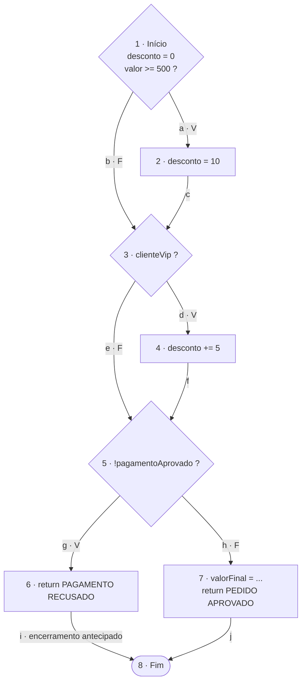
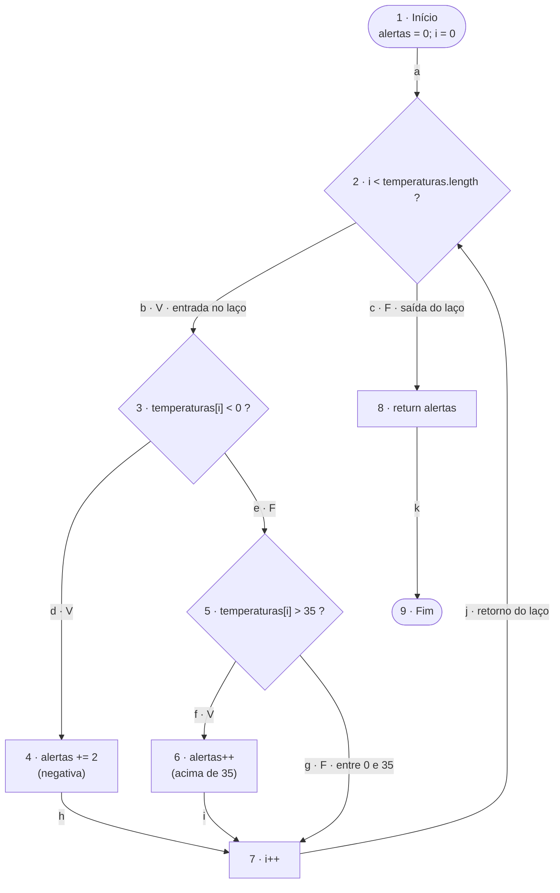

# Exercícios — Grafo de Fluxo de Controle (SEMANA 07 — Revisão)

**Aluno(s):** Thiago Gimenes e ______________________
**Disciplina:** Teste de Software — Prof. João Choma

**Conteúdo desta pasta:**

- este documento, com os blocos básicos, os CFGs, a complexidade ciclomática, a base de caminhos e as respostas às questões;
- `src/main/java/.../Exercicios.java`, com os dois métodos transcritos **sem alteração**;
- `src/test/java/...`, com testes JUnit 5 que executam cada caminho proposto e confirmam os resultados esperados.

Para executar os testes: `mvn clean test` (15 testes, todos aprovados). O relatório do JaCoCo, em `target/site/jacoco/index.html`, confirma **complexidade 4** e **100% de branches** nos dois métodos.

**Convenções dos grafos:**

- Cada nó é um **bloco básico**, uma sequência de comandos sem desvio.
- Um nó de decisão contém a condição e tem duas saídas, **V** (verdadeira) e **F** (falsa).
- O primeiro nó é o **Início**. Todos os `return` levam a um único nó **Fim**.

---

## Exercício 1 — Classificação de pedido

### 1. Blocos básicos

| Nó | Bloco básico (código) | Tipo |
|:-:|---|---|
| 1 | `double desconto = 0;` + `if (valor >= 500)` | **Início** + decisão D1 |
| 2 | `desconto = 10;` | Comando |
| 3 | `if (clienteVip)` | Decisão D2 |
| 4 | `desconto += 5;` | Comando |
| 5 | `if (!pagamentoAprovado)` | Decisão D3 |
| 6 | `return "PAGAMENTO RECUSADO";` | Retorno antecipado |
| 7 | `double valorFinal = valor - (valor * desconto / 100);` + `return "PEDIDO APROVADO: " + valorFinal;` | Retorno normal |
| 8 | Saída do método | **Fim** |

### 2. Decisões

| Decisão | Condição | Saída V | Saída F |
|:-:|---|---|---|
| D1 (nó 1) | `valor >= 500` | nó 2 (aplica 10%) | nó 3 |
| D2 (nó 3) | `clienteVip` | nó 4 (soma 5%) | nó 5 |
| D3 (nó 5) | `!pagamentoAprovado` | nó 6 (return antecipado) | nó 7 |

### 3. Grafo de Fluxo de Controle



### 4. Encerramento antecipado

O `return "PAGAMENTO RECUSADO"` é o **nó 6**. Ele leva **diretamente ao Fim** pela aresta *i* e pula o nó 7, onde é calculado o `valorFinal`. Por isso o nó Fim recebe **duas** arestas (*i* e *j*): o método tem duas saídas possíveis.

### 5. Contagem

- **Nós:** 1, 2, 3, 4, 5, 6, 7, 8 → **N = 8**
- **Arestas:** a, b, c, d, e, f, g, h, i, j → **E = 10**

### 6 e 7. Complexidade ciclomática

```text
V(G) = E − N + 2 = 10 − 8 + 2 = 4
V(G) = decisões + 1 = 3 + 1 = 4   ✔ os dois cálculos coincidem
```

### 8. Base de caminhos independentes

| Caminho | Sequência de nós | Arestas novas em relação aos anteriores |
|:-:|---|---|
| C1 | 1 → 3 → 5 → 7 → 8 | b, e, h, j (caminho inicial) |
| C2 | 1 → **2** → 3 → 5 → 7 → 8 | **a, c** |
| C3 | 1 → 3 → **4** → 5 → 7 → 8 | **d, f** |
| C4 | 1 → 3 → 5 → **6** → 8 | **g, i** |

Juntos, os quatro caminhos percorrem as 10 arestas, e cada um acrescenta pelo menos uma aresta nova.

### 9 e 10. Dados de teste e resultados esperados

| Caminho | `valor` | `clienteVip` | `pagamentoAprovado` | Desconto | Resultado esperado |
|:-:|:-:|:-:|:-:|:-:|---|
| C1 | 100 | false | true | 0% | `PEDIDO APROVADO: 100.0` |
| C2 | 500 | false | true | 10% | `PEDIDO APROVADO: 450.0` |
| C3 | 100 | true | true | 5% | `PEDIDO APROVADO: 95.0` |
| C4 | 100 | false | false | — | `PAGAMENTO RECUSADO` |

Em C2, o valor 500 testa exatamente a fronteira de `valor >= 500`. Casos complementares, também verificados no JUnit:

| `valor` | `clienteVip` | `pagamentoAprovado` | Resultado esperado |
|:-:|:-:|:-:|---|
| 499.99 | false | true | `PEDIDO APROVADO: 499.99` (logo abaixo do limite, sem desconto) |
| 1000 | true | true | `PEDIDO APROVADO: 850.0` (10% + 5% = 15%) |
| 1000 | true | false | `PAGAMENTO RECUSADO` (descontos calculados, mas descartados) |

### Questões para discussão

**Quantas combinações entre as três condições são possíveis?**
Cada condição tem dois resultados, então existem **2 × 2 × 2 = 8 combinações**. Como as três decisões são independentes (nenhuma depende do resultado da outra), as 8 são executáveis e correspondem a **8 caminhos completos** diferentes no grafo.

**O número de combinações é igual à complexidade ciclomática?**
**Não.** V(G) = 4 é o tamanho de uma **base** de caminhos linearmente independentes, ou seja, o menor conjunto de caminhos que, combinados, cobrem todas as arestas e decisões. Já as 8 combinações são **todos** os caminhos possíveis. As decisões em sequência multiplicam os caminhos (2³ = 8), mas a complexidade só **soma** 1 por decisão (3 + 1 = 4). Por exemplo, a combinação "valor ≥ 500 e VIP" (1→2→3→4→5→7→8) não entra na base, porque todas as suas arestas já aparecem em C2 e C3.

**Como o `return` dentro da terceira condição altera o grafo?**
Ele cria uma **segunda saída** do método: o nó 6 vai direto ao Fim (aresta *i*) sem passar pelo nó 7. Sem esse `return`, os dois ramos de D3 se reuniriam antes do cálculo. Com ele, o ramo verdadeiro termina o fluxo antecipadamente. O número de decisões não muda, então V(G) continua 4. O que muda é a forma do grafo: o nó Fim passa a ter duas arestas de entrada.

**É possível executar o cálculo de `valorFinal` quando o pagamento não foi aprovado?**
**Não.** A única aresta que chega ao nó 7 é a saída **F** de D3 (aresta *h*), que só é seguida quando `pagamentoAprovado == true`. Se o pagamento foi recusado, o fluxo sempre segue a aresta *g* até o nó 6 e encerra o método. Os descontos dos nós 2 e 4 podem até ser calculados antes, mas são descartados.

---

## Exercício 2 — Análise de leituras de temperatura

### 1. Blocos básicos

| Nó | Bloco básico (código) | Tipo |
|:-:|---|---|
| 1 | `int alertas = 0;` + `int i = 0;` | **Início** |
| 2 | `while (i < temperaturas.length)` | Decisão D1 (condição do laço) |
| 3 | `if (temperaturas[i] < 0)` | Decisão D2 |
| 4 | `alertas += 2;` | Comando (temperatura negativa) |
| 5 | `else if (temperaturas[i] > 35)` | Decisão D3 |
| 6 | `alertas++;` | Comando (temperatura acima de 35) |
| 7 | `i++;` | Incremento (ponto de junção dos três ramos) |
| 8 | `return alertas;` | Retorno |
| 9 | Saída do método | **Fim** |

### 2. Decisões

| Decisão | Condição | Saída V | Saída F |
|:-:|---|---|---|
| D1 (nó 2) — `while` | `i < temperaturas.length` | nó 3 (entra no laço) | nó 8 (sai do laço) |
| D2 (nó 3) — `if` | `temperaturas[i] < 0` | nó 4 | nó 5 |
| D3 (nó 5) — `else if` | `temperaturas[i] > 35` | nó 6 | nó 7 (temperatura entre 0 e 35) |

### 3 e 4. Grafo de Fluxo de Controle



O que o grafo mostra:

| Elemento pedido | Onde está no grafo |
|---|---|
| Entrada no laço | aresta **b** (D1 verdadeira) |
| As três classificações da temperatura | **nó 4** (negativa), **nó 6** (acima de 35) e aresta **g** (entre 0 e 35, sem alerta) |
| Incremento de `i` | **nó 7**, onde os três ramos se reúnem |
| Aresta de retorno para o `while` | aresta **j** (7 → 2) |
| Saída do laço | aresta **c** (D1 falsa → nó 8) |

### 5. Contagem

- **Nós:** 1 a 9 → **N = 9**
- **Arestas:** a, b, c, d, e, f, g, h, i, j, k → **E = 11**

### 6. Complexidade ciclomática

```text
V(G) = E − N + 2 = 11 − 9 + 2 = 4
V(G) = decisões + 1 = 3 + 1 = 4   ✔ os dois cálculos coincidem
```

### 7. Base de caminhos independentes

| Caminho | Sequência de nós | Arestas novas em relação aos anteriores |
|:-:|---|---|
| C1 | 1 → 2 → 8 → 9 | a, c, k (caminho inicial, sem iteração) |
| C2 | 1 → 2 → 3 → **4** → 7 → 2 → 8 → 9 | **b, d, h, j** |
| C3 | 1 → 2 → 3 → 5 → **6** → 7 → 2 → 8 → 9 | **e, f, i** |
| C4 | 1 → 2 → 3 → 5 → 7 → 2 → 8 → 9 | **g** |

Juntos, os quatro caminhos percorrem as 11 arestas.

### 8 e 9. Vetores de entrada e valores retornados

| Caminho | Objetivo | Vetor | Valor retornado |
|:-:|---|---|:-:|
| C1 | Sair do laço sem nenhuma iteração | `{}` | **0** |
| C2 | Ramo de temperatura negativa | `{-5}` | **2** |
| C3 | Ramo de temperatura superior a 35 | `{40}` | **1** |
| C4 | Ramo de temperatura entre 0 e 35, inclusive | `{20}` | **0** |

Testes complementares de fronteira e de várias iterações, também verificados no JUnit:

| Vetor | Valor retornado | Observação |
|---|:-:|---|
| `{0}` | 0 | 0 não é negativo: vai para o ramo "entre 0 e 35" |
| `{35}` | 0 | 35 não é maior que 35: não gera alerta |
| `{-0.1}` | 2 | logo abaixo de 0 |
| `{35.1}` | 1 | logo acima de 35 |
| `{-3, 0, 35, 36, -0.5}` | 5 | 2 + 0 + 0 + 1 + 2; o laço repete os ramos 4, 7 e 6 |

### 10. Por que o retorno do laço precisa aparecer no CFG?

Porque é a aresta **j** (7 → 2) que representa a **repetição**. Depois de classificar uma temperatura e incrementar `i`, o fluxo volta a avaliar `i < temperaturas.length`. Sem essa aresta:

- o grafo indicaria que o corpo do laço executa **no máximo uma vez**, o que não corresponde ao código;
- o nó 7 ficaria sem saída, e o método não teria como chegar ao `return` depois de uma iteração;
- a conta mudaria (E = 10, e V(G) = 10 − 9 + 2 = 3), deixando de bater com decisões + 1 = 4. A decisão do `while` perderia o sentido de laço.

### Questões para discussão

**Um vetor com várias temperaturas percorre um único caminho ou pode repetir partes do grafo?**
É **um único caminho**, mas esse caminho **repete partes do grafo**: a cada elemento, o fluxo passa de novo por 2 → 3 → (4 ou 5 → 6 ou 5) → 7 → 2. Por exemplo, `{-3, 40}` percorre 1 → 2 → 3 → 4 → 7 → 2 → 3 → 5 → 6 → 7 → 2 → 8 → 9. Por isso o número de caminhos possíveis cresce com o tamanho do vetor: cada iteração tem 3 ramos, o que dá 3ⁿ caminhos para n elementos. Já a base de caminhos independentes continua com 4.

**Qual entrada permite sair do método sem acessar uma posição do vetor?**
O **vetor vazio** `{}` (caminho C1). Como `temperaturas.length` é 0, a condição `0 < 0` é falsa na primeira avaliação e o fluxo vai direto de 2 para 8, sem executar `temperaturas[i]`. O método retorna 0. (Um vetor `null` não é uma entrada válida: lança `NullPointerException` já ao ler `length`.)

**Os testes dos valores `0` e `35` ajudam a avaliar quais fronteiras?**
- **0** avalia a fronteira de `temperaturas[i] < 0`: 0 **não** é negativo, então deve cair no ramo sem alerta. Se o código usasse `<= 0` por engano, o 0 somaria 2 e o teste falharia.
- **35** avalia a fronteira de `temperaturas[i] > 35`: 35 **não** gera alerta. Se o código usasse `>= 35`, o teste falharia.

Esses valores confirmam que o intervalo "normal" é **de 0 a 35, inclusive**. Os valores vizinhos -0,1 e 35,1 completam a análise de valor-limite.

**Por que o `else if` deve ser representado como uma nova decisão?**
Porque `else if` é, na prática, um **segundo `if` dentro do `else`** do primeiro. Ele tem uma condição própria (`temperaturas[i] > 35`), que só é avaliada quando a primeira é falsa, e duas saídas próprias (V → nó 6; F → nó 7). Se não virasse um nó de decisão, o grafo perderia um dos três ramos de classificação, e a complexidade ficaria em 3 em vez de 4, deixando sem teste o caso de temperatura entre 0 e 35.

---

## Verificação pelos critérios do professor

| Critério | Exercício 1 | Exercício 2 |
|---|:-:|:-:|
| Cada sequência sem desvio agrupada em um bloco básico | ✔ | ✔ |
| Cada decisão tem saída verdadeira e falsa | ✔ D1, D2, D3 | ✔ D1, D2, D3 |
| Todos os ramos voltam ao fluxo correto | ✔ nós 3, 5 e 8 | ✔ nó 7 |
| O laço apresenta aresta de retorno | não há laço | ✔ aresta j (7 → 2) |
| Todos os `return` conduzem ao encerramento | ✔ nós 6 e 7 → 8 | ✔ nó 8 → 9 |
| Todos os nós são alcançáveis | ✔ | ✔ |
| `E − N + 2` coincide com `decisões + 1` | ✔ 4 = 4 | ✔ 4 = 4 |
| Cada caminho acrescenta pelo menos uma aresta nova | ✔ | ✔ |
| Há dados de teste para cada caminho | ✔ confirmados no JUnit | ✔ confirmados no JUnit |
